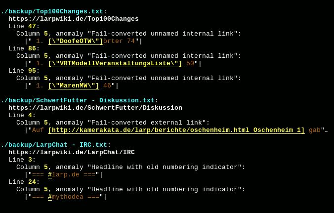

# larpWikiAnomalyScanner

Scans downloaded text files containing wiki page sources from the german
[LARP-Wiki](https://www.larpwiki.de/LarpWikiAnomalyScanner) for anomalies like
invalid UTF-8 encoding or syntax errors. It also focus on artifacts caused by a
not-so-recent migration from [UseMod](http://www.usemod.com/cgi-bin/wiki.pl) to
the current [MoinMoin](https://moinmo.in) engine.

It may or may not also be suitable for analyzing other MoinMoin wikis' page
sources. It also may or may not be a good base for writing an analyzer for other
wiki's page sources

## License

This tool has been released into the public domain. See [LICENSE](LICENSE) or
http://unlicense.org for details.

## Usage

Configure the folder containing the downloaded page source files in sourceDir
and execute the script.

When running on non-Windows in a terminal (emulator), the script output respects the width of the
terminal screen.
When the terminal supports ANSI codes, the output is colored.

## Dependencies

* Python 3 (tested with Python 3.5)

## Detected errors

* Invalid UTF-8
* Obscure code points
  * Replacement code point '�'
  * Marks in grapheme clusters without a leading letter
  * Category C except tab and some miscategorized spaces
* Invalid wiki directives
  * Redirect in other than first line after optional leading comments
  * Any non-comment non-directive after valid redirect
* Obsolete UseMod tags
  * \<b>
  * \ 
  * \<i>
  * \<nowiki>
  * \<pre>
  * \<toc>
  * \<tt>
* MoinMoin tags have to be all upper case
  * \<\ > (forced line break)
* Headlines
  * leading or trailing whitespace
  * Open and close tags of differing length
  * Level > 5
  * Missing whitespace between tags and headline text
  * Headlines with leading '#' or '*' in name (obsolete UseMod syntax)
  * Missing headline text
  * Markup in text
* Links
  * Quoted internal links (caused by failed conversion from UseMod)
  * UseMod external links
  * UseMod upload or attachment links
* Lists
  * UseMod bullet lists (line starts with '*'; also a common typo)
  * UseMod numbered list (line starts with '#') when mixed with 
    bullet lists (they look like a directive or comment otherwise)
* Obsolete UseMod paragraph modifiers (occuring at start of line)
  * Indent (leading ':')
  * Definition list (leading ';')

## History

__V1__ has been released December 2012.

__V2__, released December 2017, was a maintenance release and fixed a crash
when encountering broken UTF-8 by implementing byte-wise parsing of UTF-8 and
proper reporting. Also, the tool moved to a GIT repository and Github.

__V3__, released January 2018, improved performance a lot. Multiprocessing got
implemented and some slow code has been rewritten.
Refactorings leading to better changeability began.
